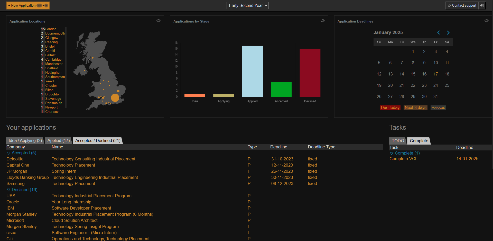

Designed for students who are applying for multiple schemes. Track your applications to internships and placements, store versions of your CV and never miss a deadline.

### Use the application live at [exeter-tracker.com](http://#)

## Features

- **Application Tracking**: Keep a record of all applications, including company details, application status, and key dates.
- **Deadline Reminders**: Never miss a deadline with our reminders about upcoming application submissions.
- **Document Management**: Store and organize different versions of CV and cover letters.
- **Analytics**: Gain insights into your application trends and manage your overall performance.
  

## Self-hosting Instructions

1. Download this repo
2. Download PocketBase from [pocketbase.io](https://pocketbase.io/), run it,  and import the schema from pocketbase_schema.json
3. Import the database schema `pb_schema.json` to PocketBase.
3. Change the variable `BASE_URL` in the `./src/contexts/pocketContext.jsx` file to the host that you are running the PocketBase instance from.
4. Build and run the React app